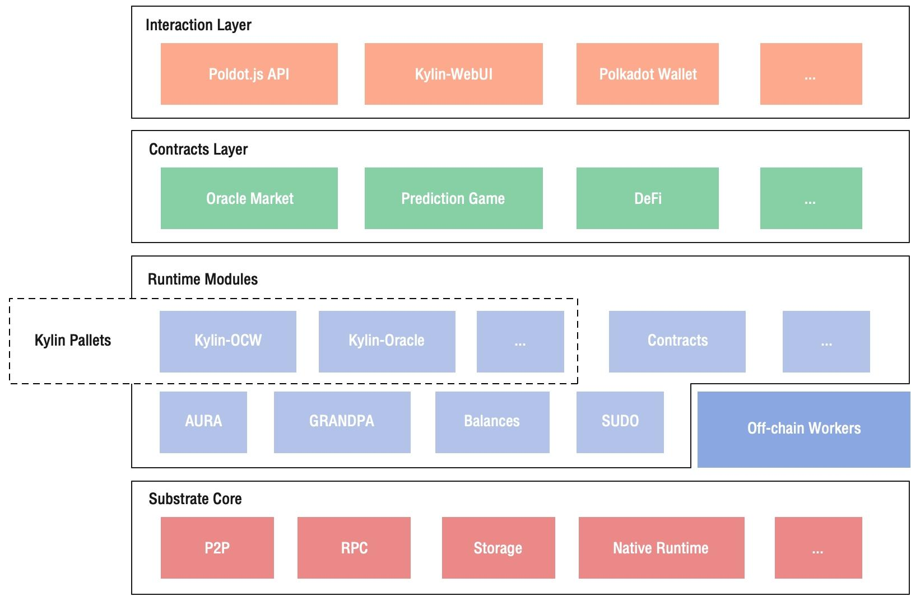
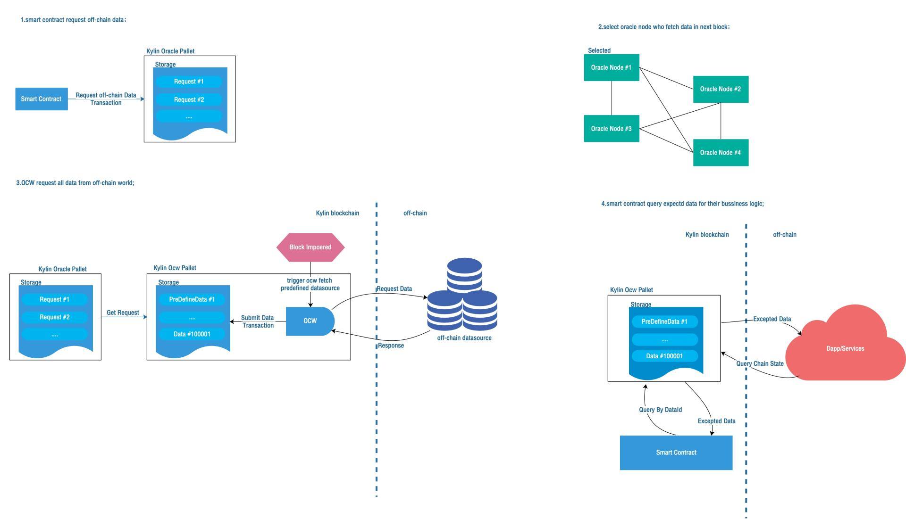
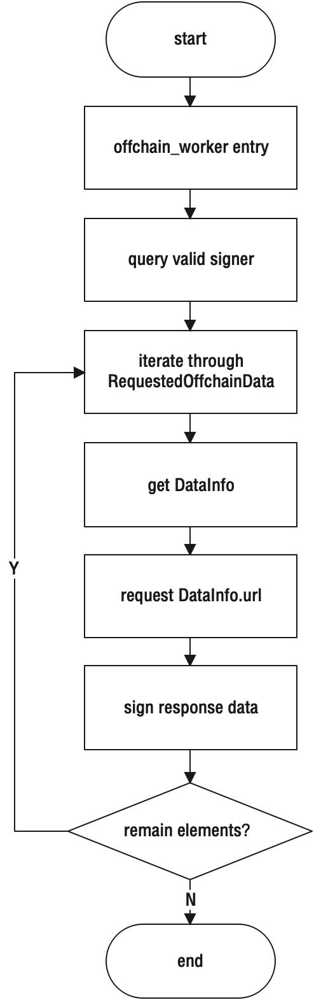

Kylin Network is developed based on the Substrate framework, which makes full use of the capability of Substrate, saves a lot of development work at the underlying of blockchain, and focuses on the business logic. As shown below,  the architecture of Kylin Network is consist of the Substrate Core, Runtime, Contracts Layer, and Interaction Layer.



Figure 1 Kylin’s relationship with Substrate

Substrate Core is provided by the Substrate framework, and Kylin focuses on the Runtime, Contracts Layer, and Interaction Layer. Kylin Node realizes the function of writing data into blockchain by customizing the Runtime Modules. The Oracle data market and related function Modules are written with smart Contracts in Layer Contracts. Polkadot JS project powers the Kylin front-end.

The main modules are as follows:

* Substrate Core

The basic functions of P2P network and data storage are realized by reusing the Substrate Core module

* Runtime Modules

The module of multiplex Substrate supports Kylin’s consensus algorithm and contract function, and Kylin-OCW and Kylin-Oracle modules are designed to realize the secure uplink of data under the chain

* Contracts Layer

Kylin Network provides Oracle Market convenient prophet service through smart contract

* Interaction Layer

The interaction layer, based on Polkadot JS, provides a way to interact with Kylin Node, as well as Kylin-web UI, and the use of Polkadot Wallets.


# Oracle data processing

All data in Kylin Network is abtained via Oracle. There are two ways to handle the process of writing data into blockchain through Oracle. One way is to use the pre-defined data source and get the uplink automatically through the node when the link is running, another way is for the user to initiate the link via a smart contract or Extrinsics. Both of these methods are protected by Kylin Network’s secure uplink process and can be used normally. The two methods are suitable for different application scenarios, developers can be based on their own needs to choose which way to link data.



Figure 2 data chaining and contract invocation

Figure 2 shows two ways to write data to blockchain. One way is through OCW, in this way it will automatically acquist the data from pre-defined data source and store the data into the blockchain. This approach is suitable for scenarios where the data source is fixed and the data is used over time. The second way is that users submit data to link via smart contract or Extrinsics, which is flexible and can be used in data link scenarios with variable data sources and cycle times. The linked data in both ways can be accessed through smart contracts. Both ultimately run as pallets in the runtime of the node.

## Data structure and storage definition

In the Alpha version, all data is stored in Map. It defines the data that contains the external service URL and the results stored in blockchain, which are stored in the Map structure with `DataId` as the only index. The Data to be stored in blockchain requested by the user is also stored in the Map. Since the `string`  is not supported in the Runtime of Substrate, `vec < U8 >` is used instead of `string`.

```plain
#[derive(Encode, Decode, Default, PartialEq, Eq)]
#[cfg_attr(feature = "std", derive(Debug))]
pub struct DataInfo {
    url: Vec<u8>,
    data: Vec<u8>,
}
decl_storage! {
    trait Store for Module<T: Trait> as OffchainWorker {
        /// define the dataId index
        DataId get(fn data_id): u64 = 10000000;
        /// requested off-chain data like lol grades
        /// dataId => result
        RequestedOffchainData get(fn requested_offchain_data): map hasher(identity) u64 => DataInfo;
    }
}
```
## The workflow of writting data to blockchain

In Kylin Network the data is submitted to the chain via OCW. The OFFFN chain (block: t: : Blocknumber) is the Off-chain Worker’s call entry. When the node executes the import block, the function is called to execute, fetching the data over HTTP and writing it to the chain. All logic that interacts with the chain should be written in this entry.



Figure 3 OCW process flow


The processing logic is shown in the figure. After getting signer, we start traversing the data service under the chain and finally write the data result signature into the blockchain.

## External call interface definition

The pallet defines multiple invocation interfaces that can be used for contracts or Extrinsics to submit the linked URL and query the data on the chain.

The interface list is as follows:

1. requestOffChainDataByHttp
    * desc: smart contract request off-chain data by using http protocol, later oracle nodes will send data to kylin chain through OCW.
    * params: http url
    * return: dataId
2. getOffChainData
    * desc: smart contract fetch expected data from oracle storage.
    * params: dataId
    * return: expected data
3. getDefaultOffChainData
    * desc: smart contract fetch expected data that is loaded by default from oracle storage, like BTC price.
    * params: predefined dataId
    * return: expected data


# Development of data link in Proxy mode

The Alpha version of Kylin Network also implements a Proxy-based data uplink. In this approach, external data is obtained and processed through a data broker, which then provides the processed data to OCW. In this way, OCW can fix the calling interface and data format, and pass the complicated external data processing to the data agent, so that the OCW module can be extended dynamically without code change. In this way, a separate data broker service needs to be run for OCW to invoke.

## Data storage definition

* APINAME: the name of the API that needs to be called, and the value stored by this item is passed to the data broker interface when the API is called. The value of this variable can be set later by an external call.
* Data PROXY URL: THE DEFAULT data proxy address, the value of which can be set later by an external call.
* RSLT: stores the results returned after an API call.
```plain
decl_storage! {
    trait Store for Module<T: Trait> as DataFetcherModule {
        // `api_name` parmas will be invoked by pallet, the name defined will be passed to data proxy
        // while invoking data API. The default value should be configured correctly based on the
        // data proxy service.
         ApiName get(fn api_name): Vec<u8> = DEFAULT_DATA_PROXY_API_NAME.as_bytes().to_vec();
         // `data_proxy_url` defines the base of API service, which points to local data proxy
         // service by default.
         DataProxyUrl get(fn data_proxy_url): Vec<u8> = DEFAULT_DATA_PROXY_ENDPOINT.as_bytes().to_vec();
         // Result saves data fetched from data proxy API, which will be sent to chain with signed
         // transaction.
         Rslt get(fn rslt): map hasher(blake2_128_concat) Vec<u8> => (T::AccountId, Vec<u8>);
    }
}
```
## How to write data to the blockchain

The process of realizing the data chain by proxy can be divided into two parts: pallet part and data proxy part. The pallet requests data from the data broker, which processes the pallet’s request and returns the data from the outside to the pallet, which writes the data to the blockchain upon receipt of the data broker’s return.

The pallet part of the data is written to the blockchain in the same way as the previous one.

The data agent currently provides the interface to the pallet in the form of a RESTful API. The current interface API definition is as follows (in OpenAPI 3 format) :

```json
openapi: 3.0.1
info:
  title: Sample Kylin Network Data Proxy
  description: 'This is a sample data proxy used for [Kylin Network](https://www.kylin.network/).'
  version: 1.0.0
tags:
- name: pallet-api
  description: API will be invoked by pallet
paths:
  /api_list:
    get:
      summary: Return API list of current data proxy
      responses:
        200:
          description: Return API list supported by current data proxy.
          content:
            application/json:
              schema:
                type: array
                items:
                  type: string
  /:
    post:
      summary: Invoke API defined in data proxy
      requestBody:
        required: true
        content:
          application/json:
            schema:
              type: object
              required:
                - api_name
              properties:
                api_name:
                  type: string
                  description: API name defined in data proxy
      responses:
        200:
          description: Return correct data to pallets
          content:
            application/json:
              schema:
                type: object # Various for different APIs
```
## The definition of external calls

In the data agent mode, the pallet is handled differently from the previous mode, including the following external calls:

1. updateDataProxyUrl
    * desc: update proxy URL。
    * params: data proxy base URL
    * return: None
2. updateApiName
    * desc: update API name
    * params: API name
    * return: None
# Smart contracts

Kylin Network provides not only the ability to link up data in the chain but also the ability to contract intelligently. Ink! As a native VM to Substrate, it’s easier to handle the data stored in Substrate, it’s less difficult to develop, it’s easier to write secure code based on the Rust class syntax, and for now, ink! Google is already actively recommending a mechanism for interacting with pallet storage, which is an advantage for the Substrate platform. Kylin Network select ink! As an environment for smart contracts.

## Oracle Market

At present, the Oracle Market contract is mainly used to store the linked data source information for users to retrieve and query data. The Service Data ID, service name, service description, service thumbnail, etc. are stored in the contract. JS apps to call the contract to upload the data source, and then through the API query results. You can also query the list of market services from the Kylin Network’s customized market services page.

```plain
#![cfg_attr(not(feature = "std"), no_std)]
use ink_lang as ink;
#[ink::contract]
mod oracle_market {
    use ink_prelude::vec::Vec;
    use ink_storage::collections::{HashMap as StorageHashMap, Vec as StorageVec};
    /// Defines the storage of your contract.
    #[ink(storage)]
    pub struct OracleMarket {
        // Store a contract owner
        owner: AccountId,
        // Store dataId's service name
        service_name_map: StorageHashMap<u64, Vec<u8>>,
        // Store dataId's service owner
        service_owner_map: StorageHashMap<u64, AccountId>,
        // Store dataId's service desc
        service_desc_map: StorageHashMap<u64, Vec<u8>>,
        // Store dataId's service thumb
        service_thumb_map: StorageHashMap<u64, Vec<u8>>,
    }
    impl OracleMarket {
        /// Constructor that initializes the `bool` value to the given `init_value`.
        #[ink(constructor)]
        pub fn new() -> Self {
            Self {
                owner: Self::env().caller(),
                service_owner_map: Default::default(),
                service_name_map: Default::default(),
                service_desc_map: Default::default(),
                service_thumb_map: Default::default(),
            }
        }
        /// A message that init a service.
        #[ink(message)]
        pub fn add_service(&mut self, data_id: u64, name: Vec<u8>, desc: Vec<u8>, thumb: Vec<u8>) {
            let account_id = Self::env().caller();
            self.service_owner_map.insert(data_id, account_id);
            self.service_name_map.insert(data_id, name);
            self.service_desc_map.insert(data_id, desc);
            self.service_thumb_map.insert(data_id, thumb);
        }
        // other query function....
、        
    }
}
```
## External data

For Kylin, the most important scenario is contract and cross-link, and Kylin focuses on contract scenario at present, by means of effective de-centralizing, the external data can be linked reliably, then the data can be trusted and the business logic can be executed outside the chain. The interaction between the contract and the pallet relies heavily on chainextensions. Call the way to call, for ink! For example, declare the pallet’s interface in # -LInk inkChainhain ] and then call it a normal function.

```plain
#![cfg_attr(not(feature = "std"), no_std)]
use ink_env::Environment;
use ink_lang as ink;
use ink_prelude::{vec::Vec};
/// kylin oracle modules definition
#[ink::chain_extension]
pub trait KylinOracleModule {
    type ErrorCode = ModuleErrorCode;
    #[ink(extension = 1)]
    fn dataId() -> Result<u64, ModuleError>;
    #[ink(extension = 2)]
    fn requestedOffchainData(dataId: u64) -> Result<Vec<u8>, ModuleError>;
}
// override env
pub enum CustomEnvironment {}
impl Environment for CustomEnvironment {
    const MAX_EVENT_TOPICS: usize =
        <ink_env::DefaultEnvironment as Environment>::MAX_EVENT_TOPICS;
    type AccountId = <ink_env::DefaultEnvironment as Environment>::AccountId;
    type Balance = <ink_env::DefaultEnvironment as Environment>::Balance;
    type Hash = <ink_env::DefaultEnvironment as Environment>::Hash;
    type BlockNumber = <ink_env::DefaultEnvironment as Environment>::BlockNumber;
    type Timestamp = <ink_env::DefaultEnvironment as Environment>::Timestamp;
    type ChainExtension = KylinOracleModule;
}
#[ink::contract(env = crate::CustomEnvironment)]
mod get_prices {
    // contract logic....
}
```

