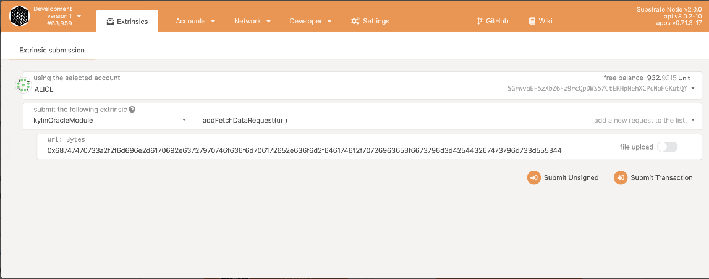
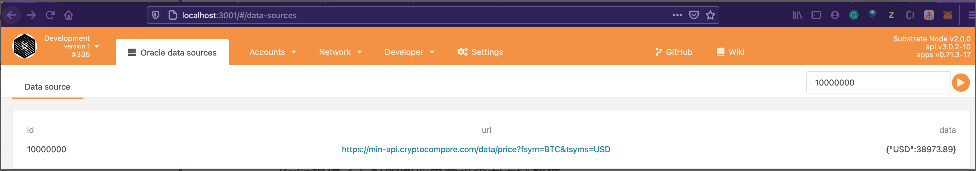
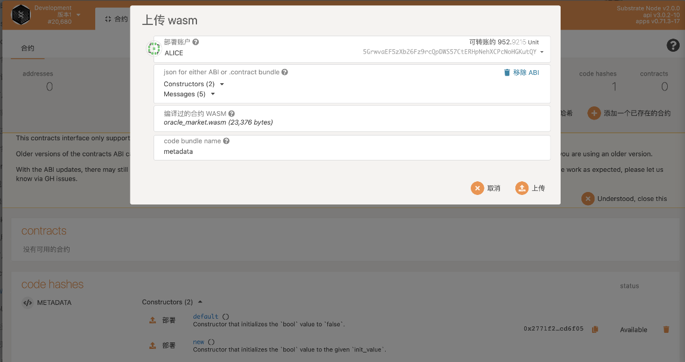

# Preparing the Runtime Environment
## Installing the rust environment

**Kylin network** is developed based on Substrate, so the Rust language is chosen. Before running the node, you need to install the relevant environment.

The recommendation is to use rustup to install and manage the rust language. For MacOS or Linux/Unix systems, you can use the following method to install.

```
curl --proto '=https' --tlsv1.2 -sSf https://sh.rustup.rs | sh
```

For Windows system, you need to download the offline installation package to install it (ref: https://forge.rust-lang.org/infra/other-installation-methods.html). The installation package is
https://static.rust-lang.org/rustup/dist/i686-pc-windows-gnu/rustup-init.exe


In addition to installing the Rust environment, you also need to prepare the wasm environment. After the rustup installation is complete, the following command can be used to install the required wasm toolchain.

```
rustup target add wasm32-unknown-unknown --toolchain nightly
rustup target add wasm32-unknown-unknown --toolchain nightly-2020-10-05
```
## Install the nodejs environment

The front-end is written in React and requires a nodejs and yarn environment to run.
Download the installation package for the corresponding system from the nodejs website (https://nodejs.org/en/download/)
Install yarn correctly according to the documentation (https://classic.yarnpkg.com/en/docs/install) and make sure it works correctly.

## Install the contract development environment

After installing the Rust environment, you need to install some dependencies to prepare for contract development.

```
rustup component add rust-src --toolchain nightly
rustup target add wasm32-unknown-unknown --toolchain stable
```

Continue installing the [ink! CLI](https://substrate.dev/substrate-contracts-workshop/#/0/setup?id=ink-cli). The final tool we will be installing is the ink! command line utility which will make setting up Substrate smart contract projects easier.
You can install the utility using Cargo with:

```
cargo install cargo-contract --vers 0.8.0 --force --locked
```

# Download and compile

The **Kylin Network** project consists of node, module, data proxy, and front-end. The steps to install and run them are described below.

## Compiling nodes and modules
First, download the node project from the official repository of **Kylin Network**

```
$ git clone --recursive https://github.com/Kylin-Network/kylin-node.git 
```
Currently, the project is managed using submodule, so the above command will download the full code and modules.
Once the download is complete, go into the directory and compile.

```
$ cd kylin-node
$ cargo build
```

Cargo will automatically resolve dependencies based on the project's Cargo.lock.

After the compilation is complete, the runnable binaries will be generated in the `target/debug` directory

# Compiling the front-end

Download the front-end project from the official **Kylin Network** repository

```
$ git clone https://github.com/Kylin-Network/kylin-market-frontend.git
```

Install the dependencies using yarn

```
cd kylin-market-frontend
yarn install
```

## Compiling the data proxy

The data proxy is used to collect data from third-party services and provide a uniform interface and controlled output format for OCW modules to call. The data proxy is currently written in Rust, but can be rebuilt in another framework or language to ensure a consistent interface.

```
$ git clone https://github.com/Kylin-Network/sample-data-fetcher.git
cd sample-data-fetcher
cargo build
```

## Compiling contracts

Kylin's contracts are written in ink!and include a marketplace service index contract and some test demos. Compile the contracts by following these steps.

```
git clone https://github.com/Kylin-Network/kylin-contracts.git
cd kylin-contracts/oracle_market
cargo +nightly contract build
```

## Docker
Kylin also provides Docker to compile node and modules, front end and data proxy.

### Dockfile

```
docker build -f Dockerfile -t kylin-node .
```

### Tutorial

For more details, please see the [Kylin Network Demo Docker Tutorial]()

# Startup and Usage

## Starting the node

Run the following command in the kylin-node directory to start the node.

```
$ cargo run -- --dev
```

The node will run in development mode, where there is only one node on the chain, but blocks are automatically generated for development testing.

If you do not add `--dev`, the system will run in production mode, in which the node will not automatically generate blocks after startup, but will start generating them only after another node is connected.

## Insert ocw submitters

OCW requires a valid account to store the fetched data to the chain. In dev mode, you need to call `author_insertKey` to insert a valid account. If this account is not added, the following error message will be displayed at the terminal running kylin-node.

```
ERROR No local accounts available. Consider adding one via `author_insertKey` RPC.
```

Insert OCW submitters can be done on the web UI or using curl.

### **curl**

Assuming that the kylin-node service is running on port 9933 on the local machine

```
$ curl http://localhost:9933 -H "Content-Type:application/json;charset=utf-8" -X POST  --data '{
  "jsonrpc":"2.0",
  "id":1,
  "method":"author_insertKey",
  "params": [
    "ocpf",
    "<suri>",
    "<public_key>"
  ]
}'
 
$ curl http://localhost:9933 -H "Content-Type:application/json;charset=utf-8" -X POST  --data '{
  "jsonrpc":"2.0",
  "id":1,
  "method":"author_insertKey",
  "params": [
    "dftc",
    "<suri>",
    "<public_key>"
  ]
}'
```

The parameters that need to be adjusted for the call are in the param.

* KeyType: the KeyTypeId of the OCW module, since there are two different OCWs in this demo, we need to add an account for each OCW.
* Suri: the helper of the account.
* PublicKey: the public key of the account, a string starting with 0x.

After inserting the account, you also need to **fill the account with a certain balance to pay for the data uploading cost**.

### *Web UI*

*Web UI* and *curl* use the same parameters, the specific location to call is in *Developer* -> *RPC calls*, select *author* on the left, select *insertKey* in the RPC selection on the right, and then fill in the data in the corresponding dialog box on the page and then sign and submit.

## Open Web UI

In the `kylin-market-frontend` project directory, run `yarn start`. Create a new browser window and open the project home page after the code has been compiled. The `Web UI` service runs at the *http://localhost:3001*  by default, and can be modified by passing in parameters at startup.

# Interact with the chain through the WebUI

The main way to interact with the chain is from the command line, api, etc., but there is a better option: WebUI.

Fortunately, Kylin provides a mature WebUI solution - [kylin-market-frontend](https://github.com/Kylin-Network/kylin-market-frontend)

The easiest way to start is to visit *http://localhost:3001* to set the node's ws address.


The top right corner indicates the version of each module currently in use, the above image shows the current block browser interface, the path to open is Network->Explorer, apps and many more features will be introduced below Kylin common features.

## Configuration

For apps, you need to tell it how the type is represented, you need to fill out the following configuration in *Settings->Developer*.

```
{
  "Address": "AccountId",
  "LookupSource": "AccountId",
  "DataInfo": {
    "url": "Text",
    "data": "Text"
  },
  "OracleMarketAddress": "5FpaPaNcX2HmqqEnUHGRLSF9o83K48eQtCj349Dzsn1wmoxD"
}
```

## Adding the External Data Source

Kylin can upload the data source that needs to be uploaded through an external call (Extrinsics), note that the call is to the service provided by **kylinOracleModule**. The path to open is *Developer->Extrinsics*, note that the url of the data source needs to be converted to hex format.

```
URL: https://min-api.cryptocompare.com/data/price?fsym=BTC&tsyms=USD
Hex:0x68747470733a2f2f6d696e2d6170692e63727970746f636f6d706172652e636f6d2f646174612f70726963653f6673796d3d425443267473796d733d555344
```



## Querying external data source results on the chain

Kylin provides a friendly graphical interface to query the chain data, open the path *Network->Oracle data sources*, just fill in the dataId(10000000) to query the chain results of external data sources.




## Deploy the marketplace service contract

Upload the previously compiled contract file wasm to the chain and execute the initialization, which can be operated through WebUI. The path is *Developer->Contracts*.

For the compilation of contracts, please refer to the previous section **Compiling Contracts**.



After deploying the contract, just set the contract address to the *OracleMarketAddress* field in *Settings->Developer*.

```
{
  "Address": "AccountId",
  "LookupSource": "AccountId",
  "DataInfo": {
    "url": "Text",
    "data": "Text"
  },
  "OracleMarketAddress": "xxxxxxxxxxxxxxxxxxxxxx"
}
```

## Adding Market Services

Continue to add new market services by calling the market contract from the WebUI. Open the path as *Developer->Contracts->METADATA->addService*.
You can refer to the example below.

```
dataID: 10000000
name: BTC-Price --> 0x4254432d5072696365
desc: fetch BTC price from cryptocompare-->0x6665746368204254432070726963652066726f6d2063727970746f636f6d70617265
thumb:
http://6.eewimg.cn/mp/uploads/2018/08/23/25d989a0-a6b9-11e8-9783-001e676a89bd.jpg -> 0x687474703a2f2f362e656577696d672e636e2f6d702f75706c6f6164732f323031382f30382f32332f32356439383961302d613662392d313165382d393738332d3030316536373661383962642e6a7067
```


## Querying Market Services

Continue to call the marketplace contract on WebUI to query the service details and dataId of the corresponding data source. open path is *Network->Oracle marketplace*.

