# Download Docker Image

https://drive.google.com/file/d/1sdTbaEhWZdToZ3ASeoNerOeZwfNy4KPN/view?usp=sharing

# Load the docker image
```
docker load < kylin-node.tar.gz
```
# Download the docker-compose configuration file
https://github.com/Kylin-Network/kylin-node/blob/main/scripts/docker-compose.yml

# Prepare the kylin-data-proxy.env file
It is in **the same directory as docker-compose.yml**.

```
KYLIN_API_KEY=xxxxxxxxxx
KYLIN_API_SECRET=xxxxxxxxxxxxx
```
# Start
```
docker-compose up -d
```
*insert-ocw* will first sleep for 30s and wait for the kylin node to start, then insert the ocw submitters. After 30s, please check the full log again.

# View logs

```
docker-compose logs
```
# View containers
```
docker-compose ps
```
# Web UI
http://localhost:3001/#/explorer

# Switch to Local Node
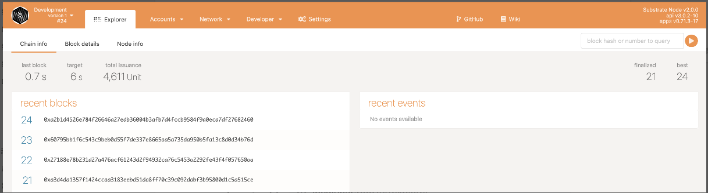
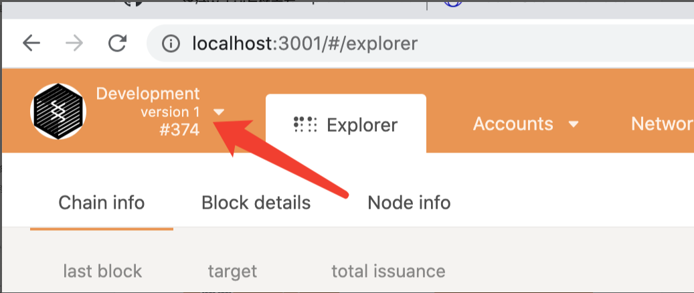
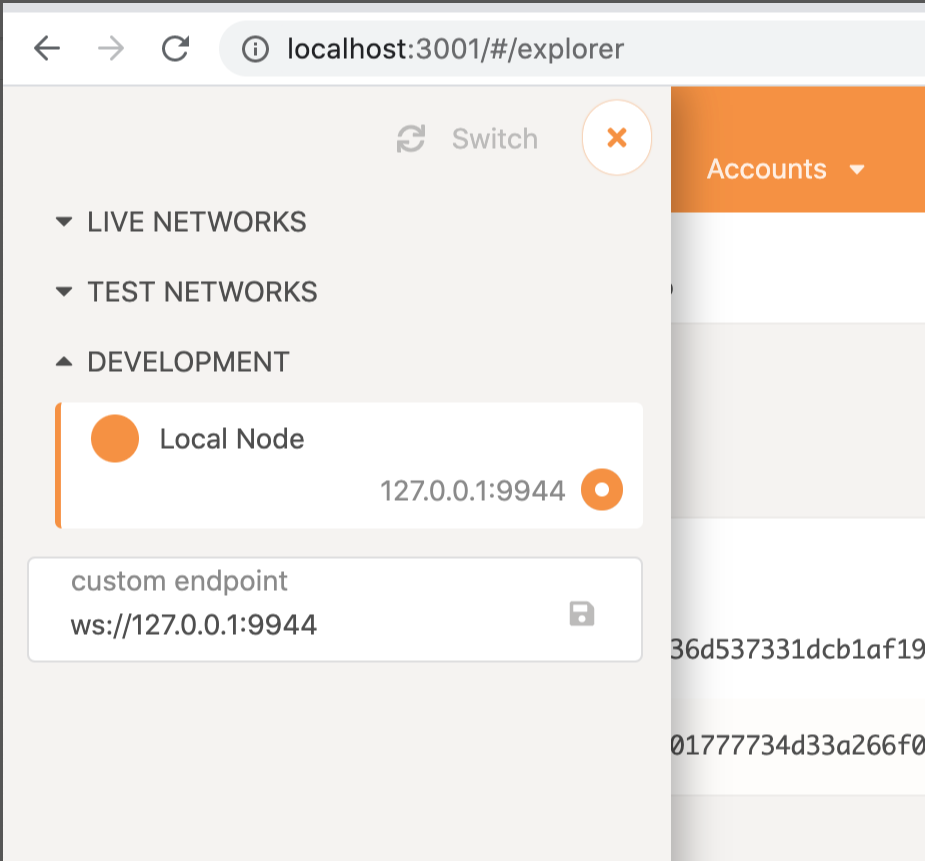

# Configuration 

```
{
  "Address": "AccountId",
  "LookupSource": "AccountId",
  "DataInfo": {
    "url": "Text",
    "data": "Text"
  }
}
```
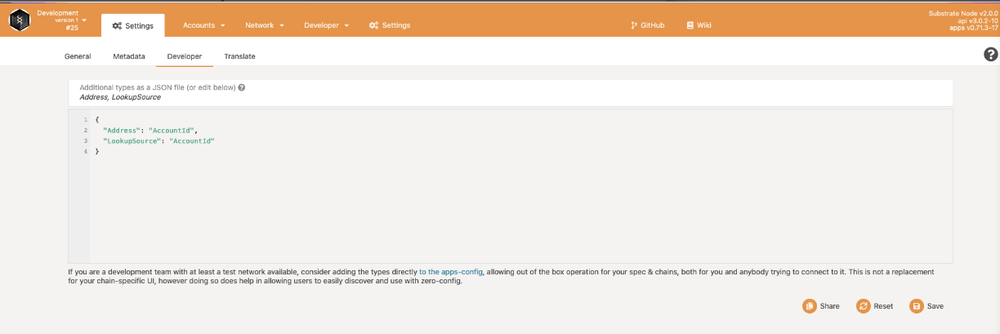

# Add a test account
If you don't have a test account TEST, use the following mnemonic seed.

```
clip organ olive upper oak void inject side suit toilet stick narrow
```
The test account is

```
5FfBQ3kwXrbdyoqLPvcXRp7ikWydXawpNs2Ceu3WwFdhZ8W4
```
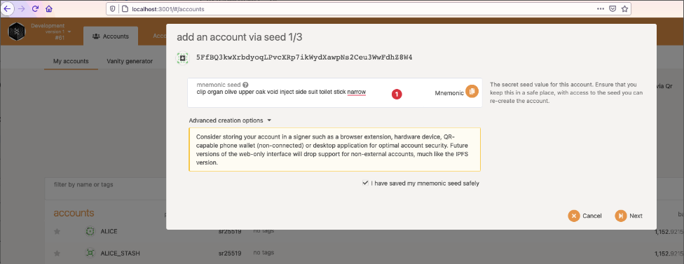

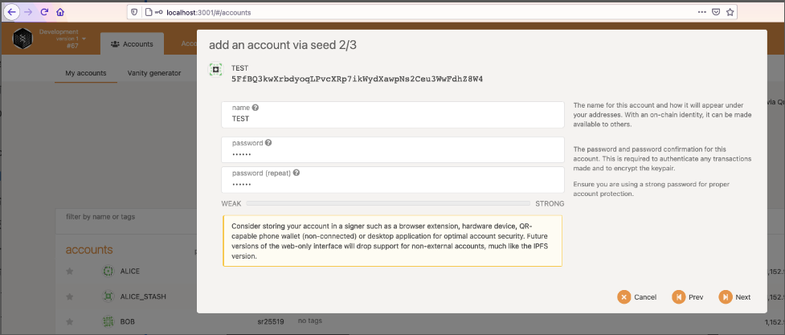


# Transferring funds to a test account
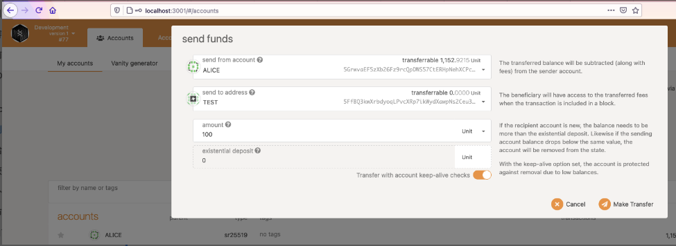

# Add fetch external data source
Kylin can upload the data source to the chain through an external call (Extrinsics).

1. *Developer->Extrinsics*, 
2. the service provided by *kylinOracleModule*
3. the url of the data source needs to be converted to hex format.

```
URL: https://min-api.cryptocompare.com/data/price?fsym=BTC&tsyms=USD
Hex:0x68747470733a2f2f6d696e2d6170692e63727970746f636f6d706172652e636f6d2f646174612f70726963653f6673796d3d425443267473796d733d555344
```
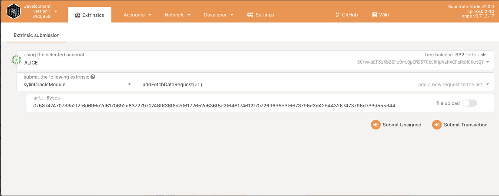

# Querying external data source results on the chain

Kylin provides a friendly GUI to query the chain data.
1. Network->Oracle data sources
2. Fill in dataId(10000000) to query the chain results of external data source.

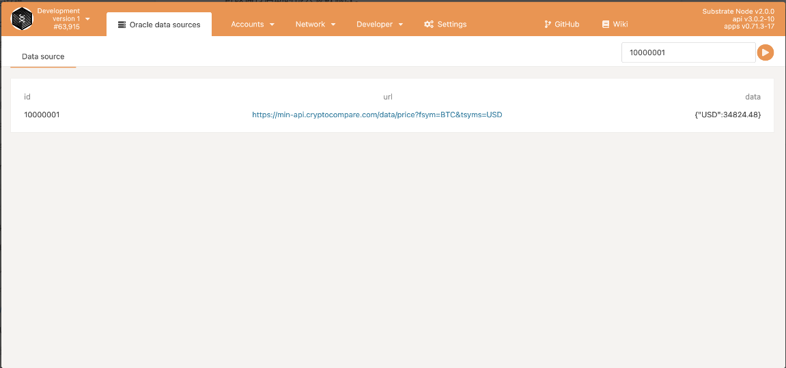

# Deploy marketplace service contract

Upload the previously compiled contract file wasm to the chain and perform the initialization, which can be done via WebUI.

For contract development and compilation, please refer to the **Compling Contracts** section of **Kylin Network Demo Tuorial** doc. 

1. *Developer->Contracts->Upload WASM*
2. upload <a href="metadata.json" target="_blank">metadata.json</a> file 
3. upload <a href="oracle_market.wasm" target="_blank">oracle_market.wasm</a> file 

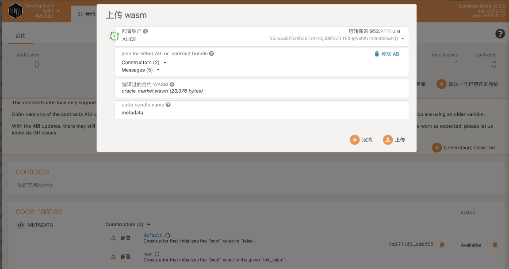

After deploying the contract, set the contract address to the **OracleMarketAddress** field in *Settings->Developer*.

```
{
  "Address": "AccountId",
  "LookupSource": "AccountId",
  "DataInfo": {
    "url": "Text",
    "data": "Text"
  },
  "OracleMarketAddress": "xxxxxxxxxxxxxxxxxxxxxx"
}
```

# Adding Marketplace Services
Continue to call the market contract on WebUI to add new market services. Open the path as **Developer->Contracts->METADATA->addService**.

```
dataID: 10000000
name: BTC-Price --> 0x4254432d5072696365
desc: fetch BTC price from cryptocompare-->0x6665746368204254432070726963652066726f6d2063727970746f636f6d70617265
thumb:
http://6.eewimg.cn/mp/uploads/2018/08/23/25d989a0-a6b9-11e8-9783-001e676a89bd.jpg -> 0x687474703a2f2f362e656577696d672e636e2f6d702f75706c6f6164732f323031382f30382f32332f32356439383961302d613662392d313165382d393738332d3030316536373661383962642e6a7067
```

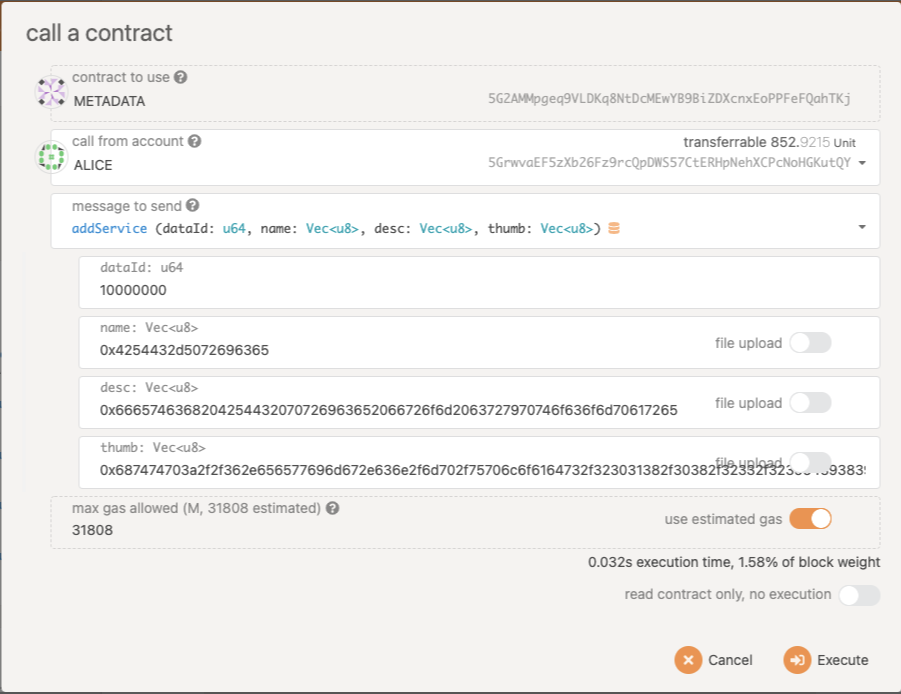

# Querying Marketplace Services

*Network->Oracle marketplace*

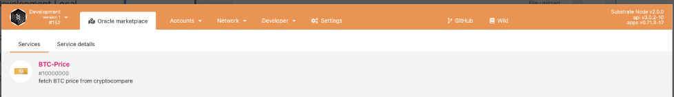
