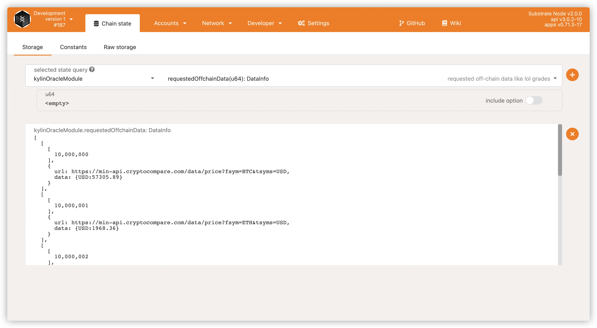
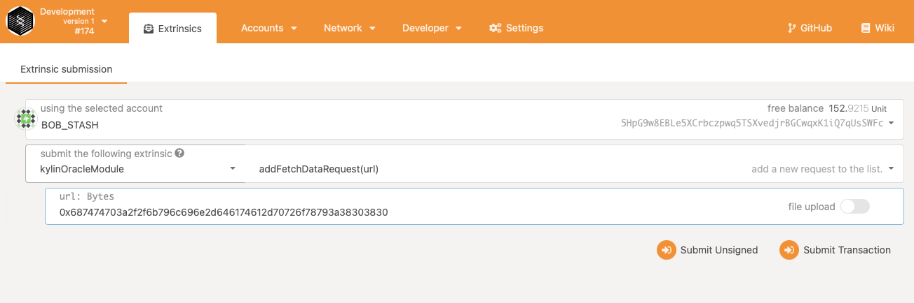
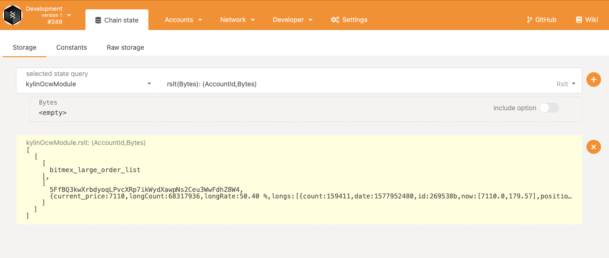
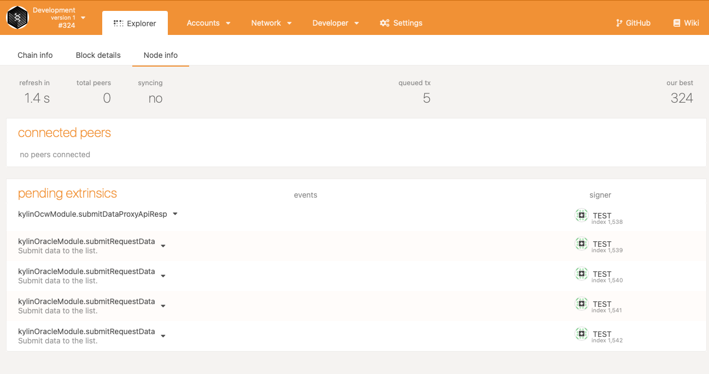
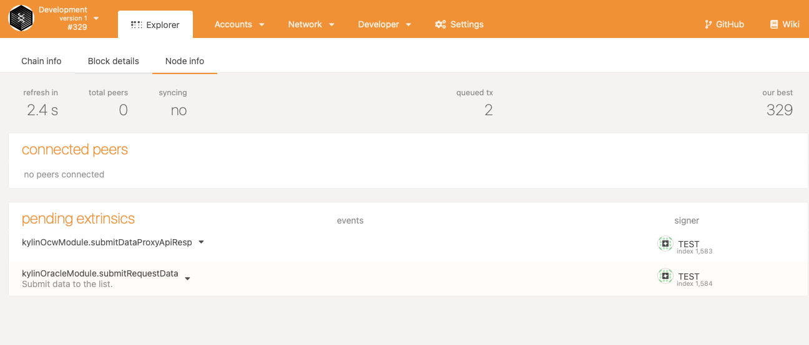
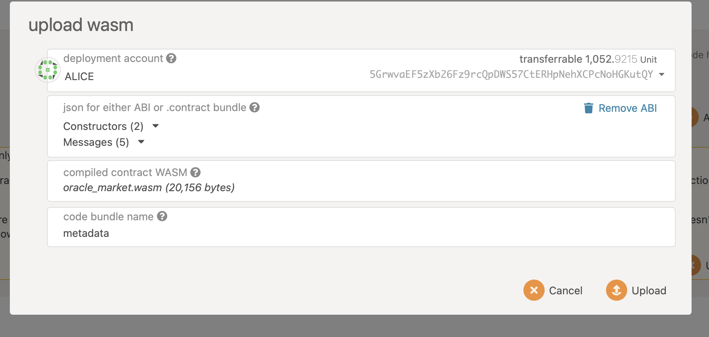
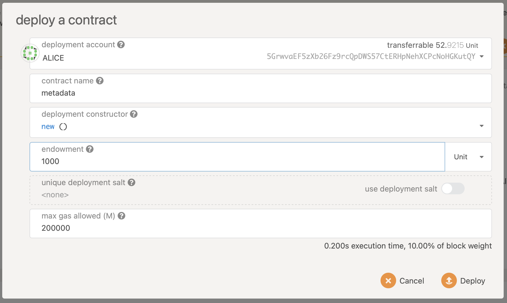
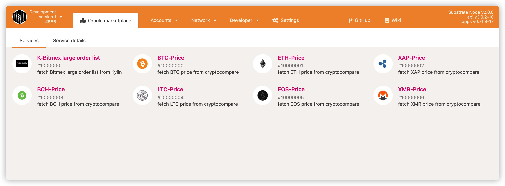
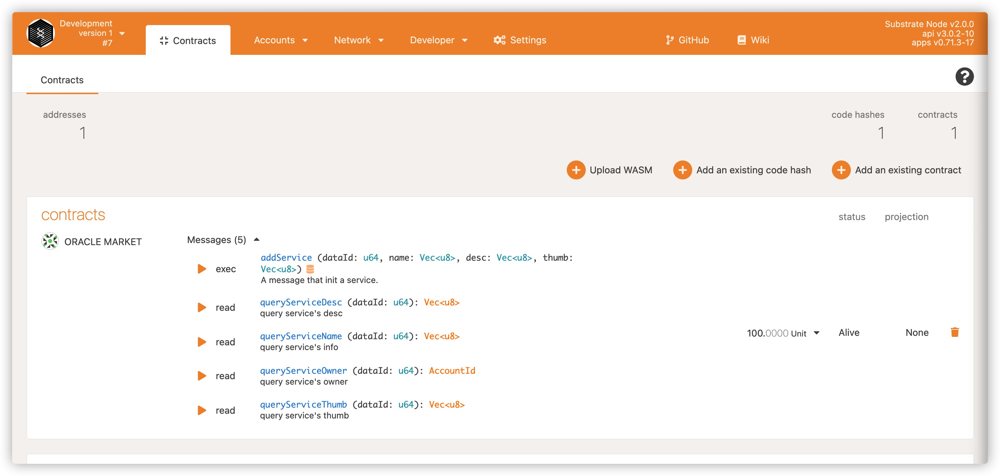
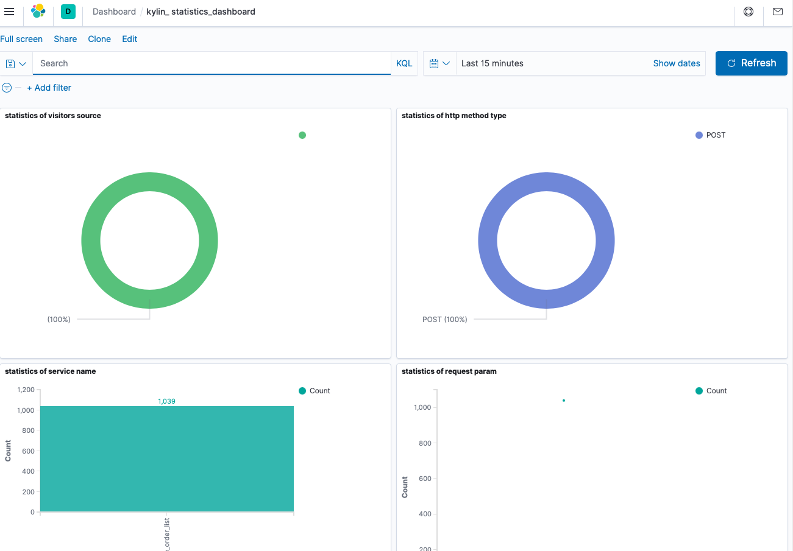

# Download Docker Image

https://drive.google.com/drive/folders/1CtuRb16zX36ZafaAZt_CpQIuW8wKsbFG?usp=sharing

# Load the docker image
```
docker load < kylin-node.tar.gz
```
# Download the docker-compose configuration file
https://github.com/Kylin-Network/kylin-node/blob/main/scripts/docker-compose.yml

By wget
`wget https://raw.githubusercontent.com/Kylin-Network/kylin-node/main/scripts/docker-compose.yml`

# Prepare the kylin-data-proxy.env file
It is in **the same directory as docker-compose.yml**.

```
KYLIN_API_KEY=xxxxxxxxxx
KYLIN_API_SECRET=xxxxxxxxxxxxx
```
# Start
```
docker-compose up -d
```
*insert-ocw* will first sleep for 30s and wait for the kylin node to start, then insert the ocw submitters. After 30s, please check the full log again.

# View logs

```
docker-compose logs
```
# View containers
```
docker-compose ps
```
# Web UI
http://localhost:3001/#/explorer

# Switch to Local Node


# Configuration 

```
{
  "Address": "AccountId",
  "LookupSource": "AccountId",
  "DataInfo": {
    "url": "Text",
    "data": "Text"
  }
}
```


# Add a test account
If you don't have a test account TEST, use the following mnemonic seed.

```
clip organ olive upper oak void inject side suit toilet stick narrow
```
The test account is

```
5FfBQ3kwXrbdyoqLPvcXRp7ikWydXawpNs2Ceu3WwFdhZ8W4
```


# Transferring funds to a test account


## Insert ocw submitters

OCW requires a valid account to store the fetched data to the chain. In dev mode, you need to call `author_insertKey` to insert a valid account. If this account is not added, the following error message will be displayed at the terminal running kylin-node.

```
ERROR No local accounts available. Consider adding one via `author_insertKey` RPC.
```

Insert OCW submitters can be done on the web UI or using curl.

### **curl**

Assuming that the kylin-node service is running on port 9933 on the local machine

```
# insert aura key
curl http://localhost:9933 -H "Content-Type:application/json;charset=utf-8" -X POST  --data '{
  "jsonrpc":"2.0",
  "id":1,
  "method":"author_insertKey",
  "params": [
    "aura",
    "clip organ olive upper oak void inject side suit toilet stick narrow",
    "0x9effc1668ca381c242885516ec9fa2b19c67b6684c02a8a3237b6862e5c8cd7e"
  ]
}'

# insert gran key
curl http://localhost:9933 -H "Content-Type:application/json;charset=utf-8" -X POST  --data '{
  "jsonrpc":"2.0",
  "id":1,
  "method":"author_insertKey",
  "params": [
    "gran",
    "clip organ olive upper oak void inject side suit toilet stick narrow",
    "0xb48004c6e1625282313b07d1c9950935e86894a2e4f21fb1ffee9854d180c781"
  ]
}'

# insert ocw price_fetch key
curl http://localhost:9933 -H "Content-Type:application/json;charset=utf-8" -X POST  --data '{
  "jsonrpc":"2.0",
  "id":1,
  "method":"author_insertKey",
  "params": [
    "ocpf",
    "clip organ olive upper oak void inject side suit toilet stick narrow",
    "0x9effc1668ca381c242885516ec9fa2b19c67b6684c02a8a3237b6862e5c8cd7e"
  ]
}'

# insert ocw data_fetch key
curl http://localhost:9933 -H "Content-Type:application/json;charset=utf-8" -X POST  --data '{
  "jsonrpc":"2.0",
  "id":1,
  "method":"author_insertKey",
  "params": [
    "dftc",
    "clip organ olive upper oak void inject side suit toilet stick narrow",
    "0x9effc1668ca381c242885516ec9fa2b19c67b6684c02a8a3237b6862e5c8cd7e"
  ]
}'
```

The parameters that need to be adjusted for the call are in the param.

* KeyType: the KeyTypeId of the OCW module, since there are two different OCWs in this demo, we need to add an account for each OCW.
* Suri: the helper of the account.
* PublicKey: the public key of the account, a string starting with 0x.

After inserting the account, you also need to **fill the account with a certain balance to pay for the data uploading cost**.

### *Web UI*

*Web UI* and *curl* use the same parameters, the specific location to call is in *Developer* -> *RPC calls*, select *author* on the left, select *insertKey* in the RPC selection on the right, and then fill in the data in the corresponding dialog box on the page and then sign and submit.

# Add fetch external data source
Kylin can upload the data source to the chain through an external call (Extrinsics).

1. *Developer->Extrinsics*, 
2. the service provided by *kylinOracleModule*
3. the url of the data source needs to be converted to hex format.

```
BTC-price
URL: https://min-api.cryptocompare.com/data/price?fsym=BTC&tsyms=USD
Hex: 0x68747470733a2f2f6d696e2d6170692e63727970746f636f6d706172652e636f6d2f646174612f70726963653f6673796d3d425443267473796d733d555344

ETH-price
URL: https://min-api.cryptocompare.com/data/price?fsym=ETH&tsyms=USD
Hex: 0x68747470733a2f2f6d696e2d6170692e63727970746f636f6d706172652e636f6d2f646174612f70726963653f6673796d3d455448267473796d733d555344

XAP-price
URL: https://min-api.cryptocompare.com/data/price?fsym=XAP&tsyms=USD
Hex: 0x68747470733a2f2f6d696e2d6170692e63727970746f636f6d706172652e636f6d2f646174612f70726963653f6673796d3d584150267473796d733d555344

BCH-price
URL: https://min-api.cryptocompare.com/data/price?fsym=BCH&tsyms=USD
Hex: 0x68747470733a2f2f6d696e2d6170692e63727970746f636f6d706172652e636f6d2f646174612f70726963653f6673796d3d424348267473796d733d555344

LTC-price
URL: https://min-api.cryptocompare.com/data/price?fsym=LTC&tsyms=USD
Hex: 0x68747470733a2f2f6d696e2d6170692e63727970746f636f6d706172652e636f6d2f646174612f70726963653f6673796d3d4c5443267473796d733d555344

EOS-price
URL: https://min-api.cryptocompare.com/data/price?fsym=EOS&tsyms=USD
Hex: 0x68747470733a2f2f6d696e2d6170692e63727970746f636f6d706172652e636f6d2f646174612f70726963653f6673796d3d454f53267473796d733d555344

XMR-price
URL: https://min-api.cryptocompare.com/data/price?fsym=XMR&tsyms=USD
Hex: 0x68747470733a2f2f6d696e2d6170692e63727970746f636f6d706172652e636f6d2f646174612f70726963653f6673796d3d584d52267473796d733d555344

```


# Querying external data source results on the chain

you can query oracle data from chain state. *Developer->Chain state->Storage*, select *kylinOracleModule->requestedOffchainData(u64): DataInfo*.



But kylin provides a friendly GUI to query the chain data.  
1. Network->Oracle data sources  
2. Fill in dataId(10000000) to query the chain results of external data source.  


# Add kylin provided data source
Some data has been provided by kylin, like some exchange's orders. It is more convenience for developers to use in their Dapps. These data is proxyed by kylin.

1. Open *Developer->Extrinsics*,  
2. Chooose the service provided by *kylinOcwModule*  
3. Add proxy data source from kylin.  

```
BTC-price
URL: https://min-api.cryptocompare.com/data/price?fsym=BTC&tsyms=USD
Hex: 0x68747470733a2f2f6d696e2d6170692e63727970746f636f6d706172652e636f6d2f646174612f70726963653f6673796d3d425443267473796d733d555344

```



# Querying kylin provided data on the chain

you can query oracle data from chain state. *Developer->Chain state->Storage*, select *kylinOcwModule->rslt(Bytes): (AccountId,Bytes)*.



After the datasources added, we can see the related events/actions in explorer as shown below





And that means the offchain data will be submitted on chain.

# Deploy marketplace service contract

Upload the previously compiled contract file wasm to the chain and perform the initialization, which can be done via WebUI.

For contract development and compilation, please refer to the **Compling Contracts** section of **Kylin Network Demo Tuorial** doc. 

1. *Developer->Contracts->Upload WASM*  
2. download <a href="metadata.json" target="_blank">metadata.json</a> file by `wget https://raw.githubusercontent.com/Kylin-Network/documents/main/metadata.json`  
3. download <a href="oracle_market.wasm" target="_blank">oracle_market.wasm</a> file  `wget https://raw.githubusercontent.com/Kylin-Network/documents/main/oracle_market.wasm` 

  

  

After deploying the contract, set the contract address to the **OracleMarketAddress** field in *Settings->Developer*.  

```
{
  "Address": "AccountId",
  "LookupSource": "AccountId",
  "DataInfo": {
    "url": "Text",
    "data": "Text"
  },
  "OracleMarketAddress": "xxxxxxxxxxxxxxxxxxxxxx"
}
```

# Adding Marketplace Services
Continue to call the market contract on WebUI to add new market services. Open the path as **Developer->Contracts->METADATA->addService**. It contains kylin provided data and user-define data.

```
Kylin-Bitmex large order list
dataID: 1000000
name: K-Bitmex large order list --> 0x4b2d4269746d6578206c61726765206f72646572206c697374
desc: fetch Bitmex large order list from Kylin --> 0x6665746368204269746d6578206c61726765206f72646572206c6973742066726f6d204b796c696e
thumb:
https://ss1.bdstatic.com/70cFuXSh_Q1YnxGkpoWK1HF6hhy/it/u=3214861301,1731185104&fm=26&gp=0.jpg -> 0x68747470733a2f2f7373312e62647374617469632e636f6d2f37306346755853685f5131596e78476b706f574b314846366868792f69742f753d333231343836313330312c3137333131383531303426666d3d32362667703d302e6a7067

BTC-Price
dataID: 10000000
name: BTC-Price --> 0x4254432d5072696365
desc: fetch BTC price from cryptocompare --> 0x6665746368204254432070726963652066726f6d2063727970746f636f6d70617265
thumb:
https://n.sinaimg.cn/sinacn14/200/w500h500/20180503/1866-fzyqqiq3337874.jpg --> 0x68747470733a2f2f6e2e73696e61696d672e636e2f73696e61636e31342f3230302f77353030683530302f32303138303530332f313836362d667a7971716971333333373837342e6a7067

ETH-Price
dataId: 10000001
name: ETH-Price -->  0x4554482d5072696365
desc: fetch ETH price from cryptocompare --> 0x6665746368204554482070726963652066726f6d2063727970746f636f6d70617265
thumb: 
https://n.sinaimg.cn/sinacn14/600/w300h300/20180503/4591-fzrwiaz3053934.jpg --> 0x68747470733a2f2f6e2e73696e61696d672e636e2f73696e61636e31342f3630302f77333030683330302f32303138303530332f343539312d667a727769617a333035333933342e6a7067

XAP-Price
dataId: 10000002
name: XAP-Price -->  0x5841502d5072696365
desc: fetch XAP price from cryptocompare --> 0x6665746368205841502070726963652066726f6d2063727970746f636f6d70617265
thumb: 
https://n.sinaimg.cn/sinacn14/572/w286h286/20180503/62b0-fzyqqiq3338955.jpg --> 0x68747470733a2f2f6e2e73696e61696d672e636e2f73696e61636e31342f3537322f77323836683238362f32303138303530332f363262302d667a7971716971333333383935352e6a7067

BCH-Price
dataId: 10000003
name: BCH-Price -->  0x4243482d5072696365
desc: fetch BCH price from cryptocompare --> 0x6665746368204243482070726963652066726f6d2063727970746f636f6d70617265
thumb: 
https://n.sinaimg.cn/sinacn14/620/w311h309/20180503/0bd0-fzrwiaz3053969.jpg --> 0x68747470733a2f2f6e2e73696e61696d672e636e2f73696e61636e31342f3632302f77333131683330392f32303138303530332f306264302d667a727769617a333035333936392e6a7067

LTC-Price
dataId: 10000004
name: LTC-Price -->  0x4c54432d5072696365
desc: fetch LTC price from cryptocompare --> 0x6665746368204c54432070726963652066726f6d2063727970746f636f6d70617265
thumb: 
https://n.sinaimg.cn/sinacn14/480/w640h640/20180503/d6e2-fzyqqiq3339187.jpg --> 0x68747470733a2f2f6e2e73696e61696d672e636e2f73696e61636e31342f3438302f77363430683634302f32303138303530332f643665322d667a7971716971333333393138372e6a7067

EOS-Price
dataId: 10000005
name: EOS-Price -->  0x454f532d5072696365
desc: fetch EOS price from cryptocompare --> 0x666574636820454f532070726963652066726f6d2063727970746f636f6d70617265
thumb: 
https://n.sinaimg.cn/sinacn14/656/w328h328/20180503/25eb-fzyqqiq3339684.jpg --> 0x68747470733a2f2f6e2e73696e61696d672e636e2f73696e61636e31342f3635362f77333238683332382f32303138303530332f323565622d667a7971716971333333393638342e6a7067

XMR-Price
dataId: 10000006
name: XMR-Price -->  0x584d522d5072696365
desc: fetch XMR price from cryptocompare --> 0x666574636820584d522070726963652066726f6d2063727970746f636f6d70617265
thumb: 
https://n.sinaimg.cn/sinacn14/720/w360h360/20180503/55a9-fzyqqiq3339832.jpg --> 0x68747470733a2f2f6e2e73696e61696d672e636e2f73696e61636e31342f3732302f77333630683336302f32303138303530332f353561392d667a7971716971333333393833322e6a7067

```



# Querying Marketplace Services

you can query services from contract calls. Input the dataId and query service info.



also can query from webUI *Network->Oracle marketplace*.


# Statistics
The shipped docker compose cluster contains Elasticsearch and Kibana for data analysis.

For each data request sent sent to data proxy, the proxy will log those fields to Elasticsearch:

* request_id
* service_name
* source
* url_path
* url_query
* request_method
* request_body
* request_time
* response_time
* response_body

Besides the data sent to Elasticsearch, there is also a kibana instance setup for visulaize request data.

After setting up done, the kibana can be accessed via *http://localhost:5601*. 

> Note: the Elasticsearch index and Kibana dashboard are loaded via RESTful API call after sleeping a fixed period (currently this time is 2 mins). During the test, the time is enough for ES and Kibana initalization. But if no dashboard shown in Kibana, please re-run the instance with this command:
> $ docker-compose up init-es-index init-kibana-dashboard
> Please wait for at least 2 mins to make sure the ES and Kibana data are imported.

The landing page of Kibana shows all elements installed, please select dashboard,  choose the kylin related dashboard, then the proxy stastics data can be checked on the page. The dashboard can be found here *http://localhost:5601/app/kibana#/dashboards*


